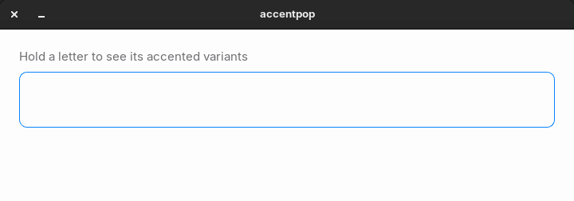

# mac-muscle-memory

**macOS typing habits, on your Linux desktop. Hold a key, pick an accent, keep typing.**

[](LICENSE)




Small, independent tools that bring macOS typing and input ergonomics to a
Linux desktop, without a macOS-themed distro and without replacing your
desktop environment. Install only the ones you want.

## Why

On a Mac, you hold `n` and a small popup offers `ñ`. Hold `e` and you get
`é è ê ë`. After years of that, dead keys and Compose sequences feel like a step
backwards, and switching keyboard layouts just to write one word in Spanish,
French or German breaks your flow.

This project recreates that press-and-hold habit on GNOME/X11, so the muscle
memory you already have keeps working.

## Quick install

```bash
git clone https://github.com/ismae147/mac-muscle-memory.git
cd mac-muscle-memory
./accentpop/install.sh
```

Then hold `a` in any text field for about 300 ms. No `sudo`, no system packages.

## Tools

| Tool | What it gives you | Status |
|------|-------------------|--------|
| [accentpop](accentpop/) | Press-and-hold a letter to pick an accented variant from a numbered popup, at the text caret | Working |

## Features (accentpop)

- **Press and hold.** Hold a letter for ~300 ms and a numbered popup with its
  accented variants appears, macOS-style.
- **Fast picking.** `1`–`9` inserts a variant, `←` `→` plus `Enter`/`Space`
  also work. `Esc` cancels. `BackSpace` closes the popup and deletes the letter.
- **Uppercase with Shift.** Hold `Shift` + `e` for `È É Ê Ë Ē Ė Ę`.
- **Spanish punctuation.** Hold `/` for `¿` and `¡`, no `Shift` gymnastics.
- **Appears where you type.** The popup anchors at the text caret, reported by
  IBus (Chromium, Electron, Qt WebEngine apps, browsers) or AT-SPI (GTK apps).
  Without either, it uses your last left click, then the mouse pointer.
- **Works with IBus apps, including Flatpak.** Characters are injected through
  persistent spare keycodes, so asynchronous input paths do not drop them.
- **Reversible.** Autorepeat and keycodes are restored when the service stops.

## Compatibility

| | Status |
|---|---|
| Session | X11 only. Wayland is not supported |
| Desktop | GNOME. Tested on Zorin OS 18 (Ubuntu-based), GNOME Shell 46 |
| Input method | IBus recommended (best caret placement); works without it |
| GTK apps | Caret via AT-SPI and IBus |
| Chromium, Chrome, Electron, Qt WebEngine (for example ZapZap) | Caret via IBus, including Flatpak builds |
| Apps with no caret reporting | Popup at your last left click, else the mouse pointer |
| Requirements | `python3`, PyGObject with GTK 3 (preinstalled on GNOME) |

Other GNOME/X11 systems are likely to work. Reports from other distributions
and desktops are welcome, see [Contributing](CONTRIBUTING.md).

## Privacy

accentpop observes the keyboard, because that is how press-and-hold works. It is
built to know as little as possible:

- It matches key **codes** against 18 trigger keys. Nothing else looks at them.
- Caret tracking reads **geometry only** (a rectangle on screen), never the text
  of any field.
- Nothing is written to disk, and logs never contain what you type.
- No network access. It talks only to the local X server, IBus and AT-SPI.

The daemon is a single Python file, [`accentpop/accentpop.py`](accentpop/accentpop.py),
so you can audit it in one sitting. Details in the
[accentpop README](accentpop/README.md#what-it-reads).

## Uninstall

```bash
systemctl --user disable --now accentpop
rm -rf ~/.local/share/accentpop ~/.config/systemd/user/accentpop.service
systemctl --user daemon-reload
```

Stopping the service already restores keyboard autorepeat and the keycodes it
used. Then delete the cloned folder.

## Roadmap

> These are **ideas, not commitments**. Nothing below exists yet.

- Idea: a macOS-style text replacement tool (for example `omw` → `On my way!`).
- Idea: macOS-like word navigation and deletion shortcuts in a separate,
  opt-in tool.
- Idea: an optional preferences file for the accentpop variant sets and hold delay.

Have a suggestion? Open an issue using the feature request form.

## Design rules

These are deliberate constraints, not accidents:

- **No root.** Nothing here needs `sudo`. Dependencies live in a per-tool venv.
- **No system packages.** Installing a tool never touches `apt`.
- **Reversible.** Every tool restores the state it changed when it stops.
- **No telemetry, no logging of what you type.** Tools that observe the
  keyboard say so explicitly in their own README, and explain what they read.

## Contributing

Bug reports, compatibility reports and pull requests are welcome. Read
[CONTRIBUTING.md](CONTRIBUTING.md) first.

## License

[MIT](LICENSE) © 2026 ismae147
