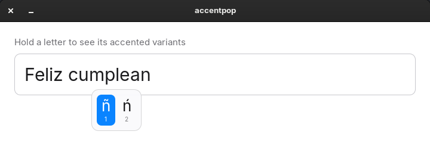

# accentpop

Hold a letter key for 300 ms and a numbered popup appears **at the text caret**
with that letter's accented variants. Press the number to insert it. This is the
macOS press-and-hold behaviour, on GNOME/X11.



## Quick path

```bash
./install.sh
```

Then hold `a` in any text field for 300 ms.

`install.sh` needs no root. It creates a venv at `~/.local/share/accentpop/venv`
(inheriting the system PyGObject), installs `python-xlib` into it, runs a
self-test and enables a `systemd --user` service. It refuses to run in a Wayland
session.

To verify it is running:

```bash
systemctl --user status accentpop
journalctl --user -u accentpop -n 10
```

Expected log on a healthy start:

```
accentpop: autorepeat disabled for 18 trigger keys via XChangeKeyboardControl
accentpop: reserved 15 keycodes for injection, 13 characters preloaded
accentpop: caret tracking active via IBus
accentpop: caret tracking active via AT-SPI
accentpop: watching 18 trigger keys, hold 300ms to open the picker
```

The keycode counts depend on your keyboard layout.

## Keys

| Key | Action |
|-----|--------|
| `1`–`9` | Insert that variant immediately |
| `←` `→` | Move the highlight |
| `Enter` / `Space` | Insert the highlighted variant |
| `Esc` | Cancel, keep the plain letter |
| `BackSpace` | Close the popup and delete the plain letter |

Releasing the held key does **not** close the popup, same as macOS. Holding a
key together with `Ctrl`, `Alt` or `Super` never opens it, so shortcuts are
unaffected.

## Triggers

| Hold | Get |
|------|-----|
| `a` | à á â ä æ ã å ā |
| `e` | è é ê ë ē ė ę |
| `i` | î ï í ī į ì |
| `o` | ô ö ò ó œ ø ō õ |
| `u` | û ü ù ú ū |
| `n` | ñ ń |
| `c` | ç ć č |
| `y` | ÿ ý |
| `s` | ß ś š |
| `z` | ž ź ż |
| `l` `g` `d` `t` `r` `w` `k` | ł ğ ð þ ŕ ŵ ķ |
| `/` | ¿ ¡ |

Hold `Shift` for the uppercase set (`Shift`+`s` gives `Ś Š`, since `ß` has no
single-character uppercase). `/` is not a macOS trigger. It is here because `¿`
and `¡` need `Shift` on a US layout, which makes them awkward.

## Where the popup appears

X11 does not expose the text caret position; only the focused application knows
it. accentpop combines several sources and uses the freshest one:

| Source | Covers |
|--------|--------|
| IBus | Every app that uses the IBus input method reports its caret rectangle so IBus can place its candidate window. This covers Chromium, Chrome, Electron and Qt WebEngine apps (for example ZapZap and other WhatsApp clients), browsers, and Flatpak builds of them |
| AT-SPI | GTK apps and other toolkits that expose text accessibility. Only events from the process that owns the active window are trusted |
| Last left click | Apps that report no caret. People usually click where they are about to type. A click newer than the last caret report also wins |
| Mouse pointer | Final fallback |

Caret reports older than 15 seconds are ignored. If there is no room below the
text line, the popup flips above it.

## How it works

| Concern | Decision |
|---------|----------|
| Observing keys | X11 `RECORD` extension, on its own dedicated X connection |
| Why not evdev | Remappers such as `keyd` work at evdev level; two grabbers would fight. X11 sits above them, so they coexist |
| Holding types one letter | Per-key autorepeat is disabled for the 18 trigger keys only, and restored on exit |
| Inserting the character | `BackSpace`, a short pause, then the variant, injected via `XTEST` |
| Injection keycodes | Unused keycodes are reserved at startup and stay mapped. Common Spanish characters (`ñ á é í ó ú ¿ ¡`, their uppercase forms and `ü`) are preloaded; other characters take a spare slot on demand. Four unused keycodes are left free for other tools |
| Apps behind IBus | IBus processes keys asynchronously, so the variant could overtake the `BackSpace`. The pause lets the `BackSpace` settle first, and persistent keycodes mean slow clients (Flatpak Qt/Chromium) never see a keycode that was already restored |
| Not breaking `Ctrl+BackSpace` | Held `Ctrl`/`Alt`/`Super` are released around the injection and restored after |

## What it reads

**This daemon sees every keystroke you type.** That is inherent to the feature,
so here is exactly what it does with them:

- Key **codes** are matched against the 18 triggers. Nothing else looks at them.
- Nothing is written to disk. No network access. The only connections are to the
  local X server, the IBus bus and the AT-SPI bus.
- Logs contain status messages only, never the content of a key.
- IBus is used for **geometry only**: accentpop listens for the
  `SetCursorLocation` and `FocusOut` calls that apps send to the IBus panel,
  and never answers them.
- AT-SPI is used for **geometry only** (`get_character_extents`). The
  accessibility interface *is capable* of reading the text of focused fields;
  this tool does not, but you should know the capability is there.

Read [`accentpop.py`](accentpop.py). It is a single file, and the injection
and logging paths are short on purpose.

## Troubleshooting

Start with the logs:

```bash
journalctl --user -u accentpop -n 50 --no-pager
journalctl --user -u accentpop -f          # follow live
```

| Symptom | Cause and fix |
|---------|---------------|
| `install.sh` says the session is Wayland | accentpop needs X11. Log out, pick **GNOME on Xorg** from the gear menu on the login screen, and log back in |
| Service fails with `DISPLAY is not set` | Run `systemctl --user import-environment DISPLAY XAUTHORITY`, then `systemctl --user restart accentpop` |
| Log shows `IBus caret tracking unavailable` | `ibus-daemon` is not running or not your input method. Check with `ibus address`. Without IBus, Chromium/Electron/Qt apps fall back to the last click or the pointer |
| Log shows `AT-SPI caret tracking unavailable` or `AT-SPI: Unable to open bus connection` | The accessibility bus is not running. GTK apps still get the caret through IBus if it is active. Logging out and back in usually restores the bus |
| Popup appears at the mouse pointer | The app reports no caret through IBus or AT-SPI. Click in the text field first, and the popup anchors at the click |
| Popup opens but nothing is inserted | Look for `no spare keycode available` in the log: your layout has no unused keycodes. Report it with your layout (`setxkbmap -query`) |
| Holding a key does nothing in the first seconds after login | The daemon needs about 2 s to start. Keys held during that window behave normally |

## Known limits

| Limit | Detail |
|-------|--------|
| X11 only | XRecord and XTEST have no Wayland equivalent |
| No autorepeat on trigger keys | Holding `a` no longer types `aaaa`. That is the point of press-and-hold, same as macOS |
| Clicking away does not cancel | The popup grabs the keyboard only, so outside clicks are not delivered. `Esc` always works |
| At most 9 variants | Only the first nine variants of a trigger are shown |
| `kill -9` | A hard kill skips the daemon's own cleanup. The service unit still runs `xset r on` afterwards, but the reserved spare keycodes stay mapped to accented characters until you log out. They were unused, so this is harmless. `SIGTERM` and `systemctl --user stop` are fully clean |

## Lighter alternative

If you only need `ñ` and the five accented vowels, you do not need this daemon
at all. Set a Compose key and you are done:

```bash
gsettings set org.gnome.desktop.input-sources xkb-options "['compose:ralt']"
```

Then `RightAlt` `~` `n` → `ñ`, `RightAlt` `'` `a` → `á`, `RightAlt` `?` `?` → `¿`.

accentpop is worth it when you want the full variant sets, or the macOS muscle
memory.

## Uninstall

```bash
systemctl --user disable --now accentpop
rm -rf ~/.local/share/accentpop ~/.config/systemd/user/accentpop.service
systemctl --user daemon-reload
```

Stopping the service restores autorepeat and the injection keycodes.

## Development

```bash
# data-level checks, no X needed
~/.local/share/accentpop/venv/bin/python accentpop.py --selftest

# end-to-end against the running daemon, in its own focused window
~/.local/share/accentpop/venv/bin/python test_e2e.py
```

`install.sh` symlinks the running daemon to this repo, so edits here take effect
after `systemctl --user restart accentpop`. See
[CONTRIBUTING.md](../CONTRIBUTING.md).
